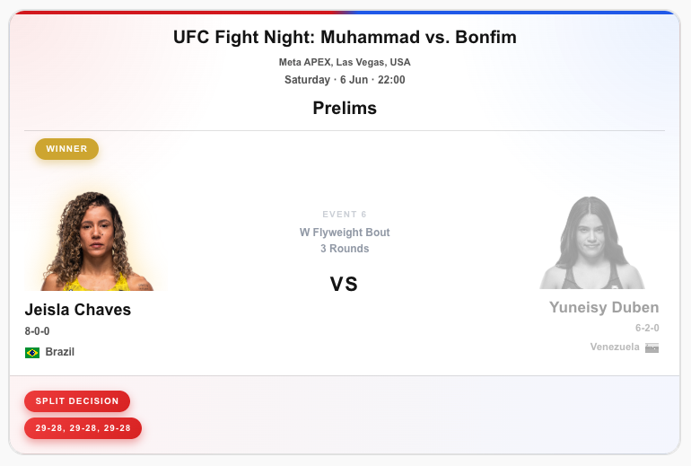
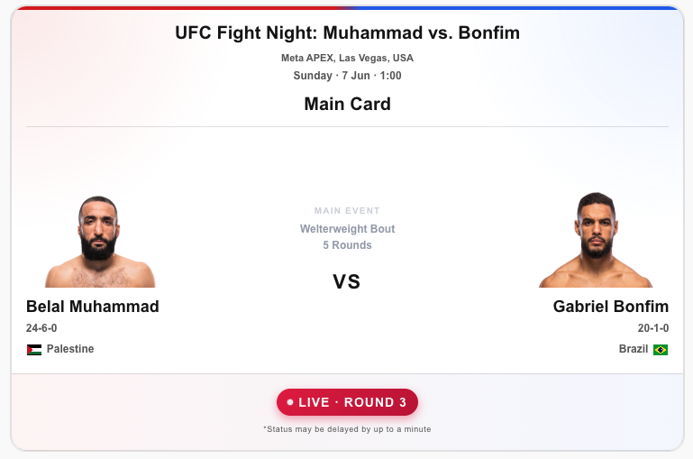
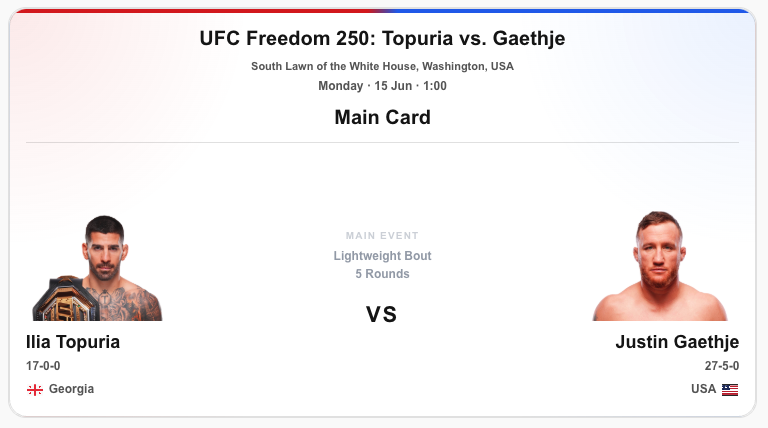
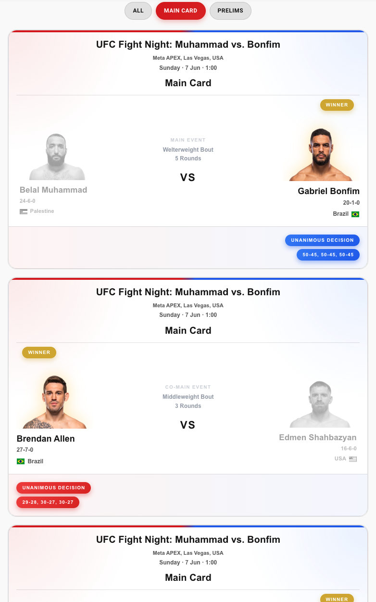

# UFC Fight Tracker Cards

A collection of beautifully designed, custom Lovelace cards for Home Assistant to visually track live UFC fights, results, and athlete stats natively on your dashboard. 

This plugin is designed specifically to be paired with the **[UFC Fight Tracker Integration](https://github.com/FadhelChaabane/ufc_fight_tracker)** backend.


## 💖 Support the Project

If you enjoy these custom cards and they make your UFC fight nights better, consider buying me a coffee! It helps keep the UI updated and supports future development.

[](https://www.buymeacoffee.com/fadhelchaabane)


---

## 📸 Screenshots & Design

The UI is meticulously designed to provide a premium, dynamic experience depending on the state of the fight. The Left Fighter always represents the Home/Red Corner, and the Right Fighter represents the Away/Blue Corner.

### Past Events (Completed Fights)

* When a fight finishes, the UI dynamically updates to highlight the winner.
* The winner receives a glowing golden badge and a golden drop-shadow behind their avatar, while the loser is subtly grayed out.
* The bottom footer pill shifts to the winner's corner (Red or Blue) and displays the method of victory (e.g., KO/TKO, Decision) and the official scorecard.

### Live Events (In Progress)

* During a live fight, a vibrant, pulsing `LIVE` badge appears in the bottom center footer.
* It dynamically displays the current Round number (e.g., `LIVE · ROUND 2`).
* *(Note: We intentionally omit the countdown clock and live betting odds to maintain a clean UI, as the API only refreshes every 30-60 seconds, which would result in a laggy clock experience).*

### Future Events (Upcoming Fights)

* Before an event starts, the UI remains perfectly clean and balanced.
* It highlights the Fighter Names, Ranks, Records, and Nationalities.
* The bottom footer remains hidden to draw focus to the Date and Time of the bout at the top of the card.

### Event Card (Multi-Entity)

* The Event Card intelligently groups all fights for an entire event.
* It features interactive filter pills (e.g., `All`, `Main Card`, `Prelims`) at the top, allowing you to instantly filter the card segments without reloading the page.

---

## Included Cards

### 1. UFC Fight Tracker Lite Card
A single-entity card perfectly suited for displaying a specific high-profile fight (like the Main Event). 

**YAML Configuration Example:**
```yaml
type: custom:ufc-fight-tracker-lite-card
entity: sensor.ufc_fight_tracker_00
```

### 2. UFC Fight Tracker Event Card
A dynamic, multi-entity card that auto-detects all your UFC sensors and groups them by event segment (e.g., Main Card, Prelims). Features interactive filtering directly in the UI!

**YAML Configuration Example (Auto-Detect):**
```yaml
type: custom:ufc-fight-tracker-event-card
auto_detect: true
```

**YAML Configuration Example (Manual Entities):**
```yaml
type: custom:ufc-fight-tracker-event-card
auto_detect: false
entities:
  - sensor.ufc_fight_tracker_00
  - sensor.ufc_fight_tracker_01
  - sensor.ufc_fight_tracker_02
```

---

## ⚖️ Legal Disclaimer & Copyright Notice

**Disclaimer of Affiliation:**
This project is a community-driven, open-source project and is **NOT** affiliated with, endorsed by, or sponsored by the Ultimate Fighting Championship (UFC), Zuffa LLC, TKO Group Holdings, ESPN, or the Walt Disney Company.

**Data Source:**
All data, imagery, headshots, and statistics utilized within these cards are dynamically retrieved via the UFC Fight Tracker integration from public-facing ESPN Core APIs. 

**Copyrights & Trademarks:**
- **UFC®** and all associated logos, branding, and fighter names are registered trademarks and copyrights of Zuffa LLC and its affiliates.
- **ESPN®** and its associated logos are registered trademarks and copyrights of ESPN Enterprises, Inc.
- All fighter images, headshots, and event data remain the exclusive intellectual property of their respective owners. 

This tool is strictly for personal, non-commercial use within local smart home environments. The developers assume no liability for the usage of this software or the data it consumes.
